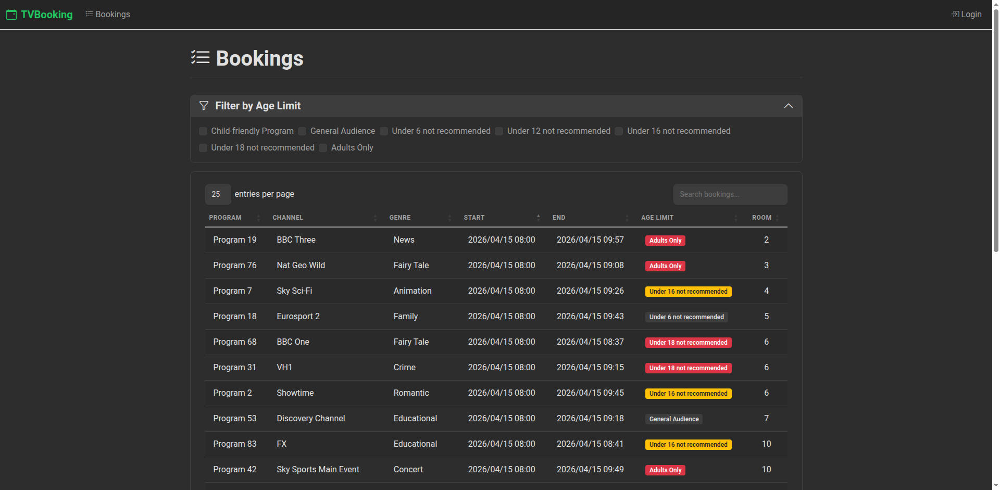
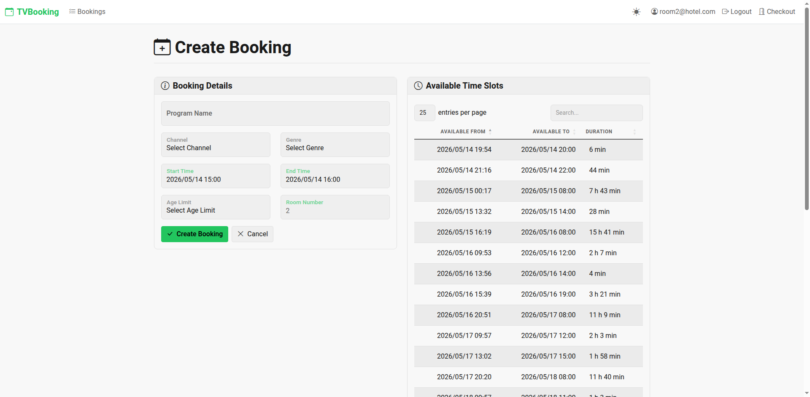
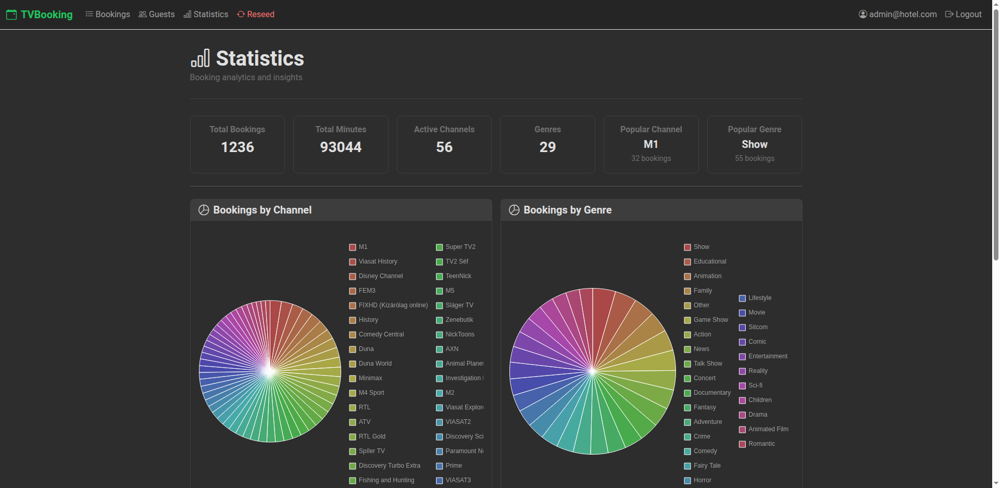
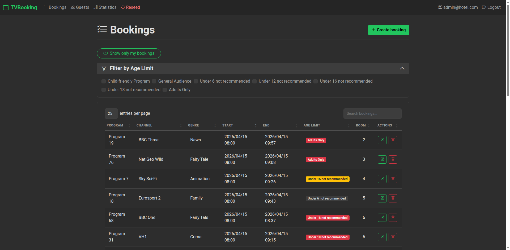

# TVBooking

<div align="center">


[](https://tvbooking-app.azurewebsites.net)

ASP.NET Core MVC app for scheduling a hotel's communal TV. Guests reserve time slots from their room; admins manage everything.

**[Demo](https://tvbooking-app.azurewebsites.net) · [Screenshots](#screenshots) · [Features](#features) · [Tech Stack](#technology-stack) · [Getting Started](#getting-started)**

</div>

---

## Live Demo

[https://tvbooking-app.azurewebsites.net](https://tvbooking-app.azurewebsites.net)

---

## Screenshots

<div align="center">







</div>

---

## Features

### Booking Management
- **Create bookings** with program name, channel, genre, start/end times, age rating, and room number
- **Edit/delete** existing bookings with ownership checks
- **74 Hungarian TV channels** (M1, RTL, HBO, Discovery, National Geographic, Eurosport, and more)
- **29 genres** (Action, Documentary, Comedy, Sports, Kids, News, etc.)
- **7 age rating categories** (Child-friendly through Adults Only)

### Smart Scheduling
- **Automatic overlap detection** -- prevents scheduling conflicts on the same room
- **Free time slot display** -- shows available gaps between existing bookings when creating or editing
- **Upcoming show banner** -- auto-alerts when a booking starts within 15 minutes
- **Color-coded age limit badges** -- red for 18+/adult, yellow for 12+/16+, gray for general

### Filtering & Discovery
- **Filter by age limit** -- collapsible checkbox panel, supports single and multi-select
- **My Bookings toggle** -- instantly filter to only your room's bookings
- **DataTables** -- sortable, searchable, pageable tables on every listing page
- **Clear filters** -- one-click reset of all active filters

### Statistics Dashboard (Admin)
- **6 summary cards** -- Total Bookings, Total Minutes, Active Channels, Genres, Most Popular Channel/Genre
- **Pie charts** -- booking distribution by channel and genre (Chart.js with auto-generated colors)
- **Line chart** -- minutes booked over time with date range filtering
- **XML export** -- download all bookings for a selected date as XML

### Guest Management (Admin)
- **Register new guests** with email and room number assignment
- **Assign or change rooms** -- reassigns all bookings from old room to new room
- **Delete guests** -- removes user and all their bookings
- **Available room tracking** -- shows which rooms are free (1-999)

### Authentication & Access Control
- **Passwordless login** -- email + room number, no password required
- **Clickable demo credentials** on the login page for quick access
- **Role-based authorization** -- Admin (room 0) has full control; guests manage only their own room
- **Hotel Checkout** -- guests can check out, deleting their account and all bookings

### Administration
- **Database Reseed** -- wipe and repopulate with fresh seed data (double-confirm safety)
- **Seed data** -- 30 days of history + 7 days of future bookings across 20 rooms
- **20 pre-registered guest accounts** (room2 through room21@hotel.com)

### User Experience
- **Dark theme** -- custom Bootstrap 5 dark design with green accent
- **Toast notifications** -- success/error messages with auto-hide
- **Responsive** -- mobile-friendly layouts with collapsed tables
- **Fully styled DataTables** -- dark-themed pagination, search, and sorting

---

## Technology Stack

| Area | Technology |
|------|------------|
| Runtime | **.NET 10** |
| Framework | **ASP.NET Core MVC** |
| Auth | **ASP.NET Core Identity** (email + room, no password) |
| Database | **SQLite** via **Entity Framework Core 10** |
| UI Framework | **Bootstrap 5** with custom dark theme |
| Tables | **DataTables** (sort, search, paginate) |
| Charts | **Chart.js 4** (pie and line charts) |
| Date/Time picker | **Flatpickr** |
| Icons | **Bootstrap Icons** |
| Testing | **xUnit**, **FluentAssertions**, **Moq**, **Selenium** |

---

## Getting Started

### Prerequisites
- [.NET 10 SDK](https://dotnet.microsoft.com/download/dotnet/10.0)
- SQLite (included, no install needed)
- Chrome/Chromium (for Selenium tests)

### Local Setup

```sh
# Clone and restore
git clone https://github.com/tothKarolyDavid/TVBooking-ASP-MVC.git
cd TVBooking-ASP-MVC

# Run the app
dotnet run --project TVBookingMVC
```

Open `https://localhost:7233` (or the URL shown in the console).

### Seeded Accounts

| Role  | Email             | Room |
|-------|-------------------|------|
| Admin | admin@hotel.com   | 0    |
| Guest | room2@hotel.com   | 2    |
| Guest | room3@hotel.com   | 3    |
| ...   | ...               | ...  |
| Guest | room21@hotel.com  | 21   |

---

## Testing

```sh
# Unit tests
dotnet test TVBookingMVC.UnitTests

# Selenium integration tests (app starts automatically, requires Chrome)
dotnet test TVBookingMVCSelenium

# Documentation screenshots (subset of Selenium tests)
dotnet test TVBookingMVCSelenium --filter "FullyQualifiedName~ScreenshotTests"
```

Screenshots are generated to `Docs/preview/`. The Selenium project runs the app in-process with an in-memory SQLite database -- no external setup needed.

---

## Solution Structure

```
TVBookingMVC/                 # Web application
  Controllers/                # Booking, Admin, Account, Guests, Home
  Models/                     # Booking, BookingReferenceData, ViewModels
  Services/                   # Validation, queries, commands, seeding, export
  Views/                      # Razor views (Booking, Guests, Admin, Shared)
  Areas/Identity/             # ASP.NET Core Identity pages
  Constants/                  # RoleNames, BookingConstants
  Migrations/                 # EF Core migrations
  wwwroot/                    # CSS, JS, libs
  Program.cs                  # App entry point

TVBookingMVC.UnitTests/       # xUnit unit tests with Moq
TVBookingMVCSelenium/         # Selenium integration tests with Page Objects
```

---

## Deployment

The app is deployed to **Azure App Service**:

- **App Service**: `tvbooking-app`
- **Plan**: Linux (F1 Free)
- **CI**: GitHub Actions (`ci.yml`) -- build, unit test, code coverage
- **CD**: GitHub Actions (`cd.yml`) -- deploy to App Service
