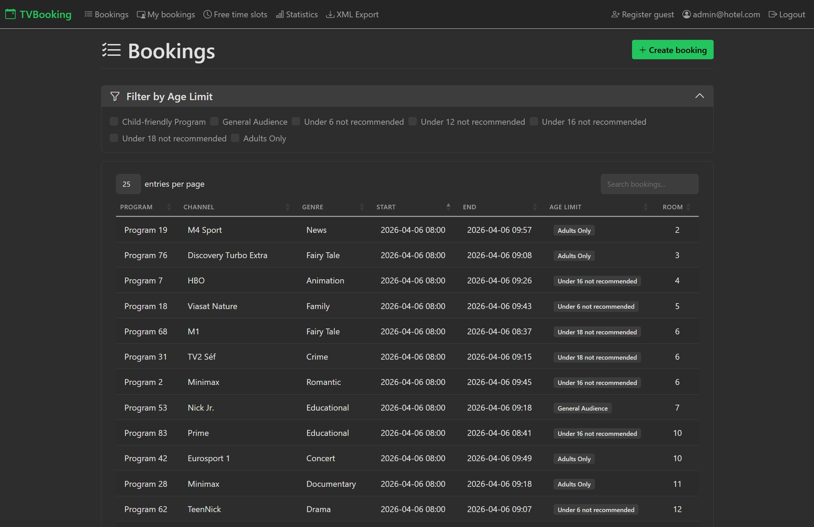
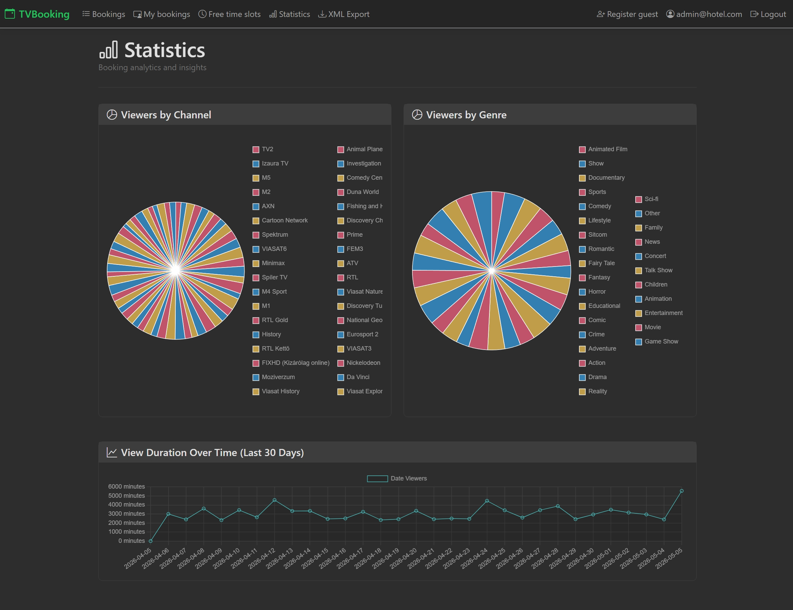

# TV Booking System

ASP.NET Core MVC app for booking a hotel's single communal TV. Guests reserve time slots from their room; admins manage everything.

## Screenshots

**Booking list**


**Statistics dashboard**


## Features

### Everyone

- Browse all bookings
- View free time slots
- Filter bookings by age rating

### Admin

- Register new guests
- Create, edit, and delete any booking
- Booking statistics dashboard (channel/genre breakdown, 30-day trends)
- Export daily bookings to XML

### Guests

- Login with email + room number (no password needed)
- Create bookings for their own room
- View their bookings
- On-page banner when a booking starts within 15 minutes

## Prerequisites

- [.NET 10 SDK](https://dotnet.microsoft.com/download/dotnet/10.0)
- SQLite (included, no install needed)

## Local setup

```sh
dotnet ef database update --project TVBookingMVC
dotnet run --project TVBookingMVC
```

The app uses SQLite (`TVBookingMVC.db`) — no database server required.

Seeded accounts:

| Role  | Email           | Room |
| ----- | --------------- | ---- |
| Admin | admin@hotel.com  | 999  |
| Guest | room2@hotel.com  | 2    |

HTTPS URL is configured in [TVBookingMVC/Properties/launchSettings.json](TVBookingMVC/Properties/launchSettings.json).

## Tests

```sh
# Unit tests
dotnet test TVBookingMVCXUnit

# Selenium tests (app must be running, Chrome/ChromeDriver required)
dotnet test TVBookingMVCSelenium
```
